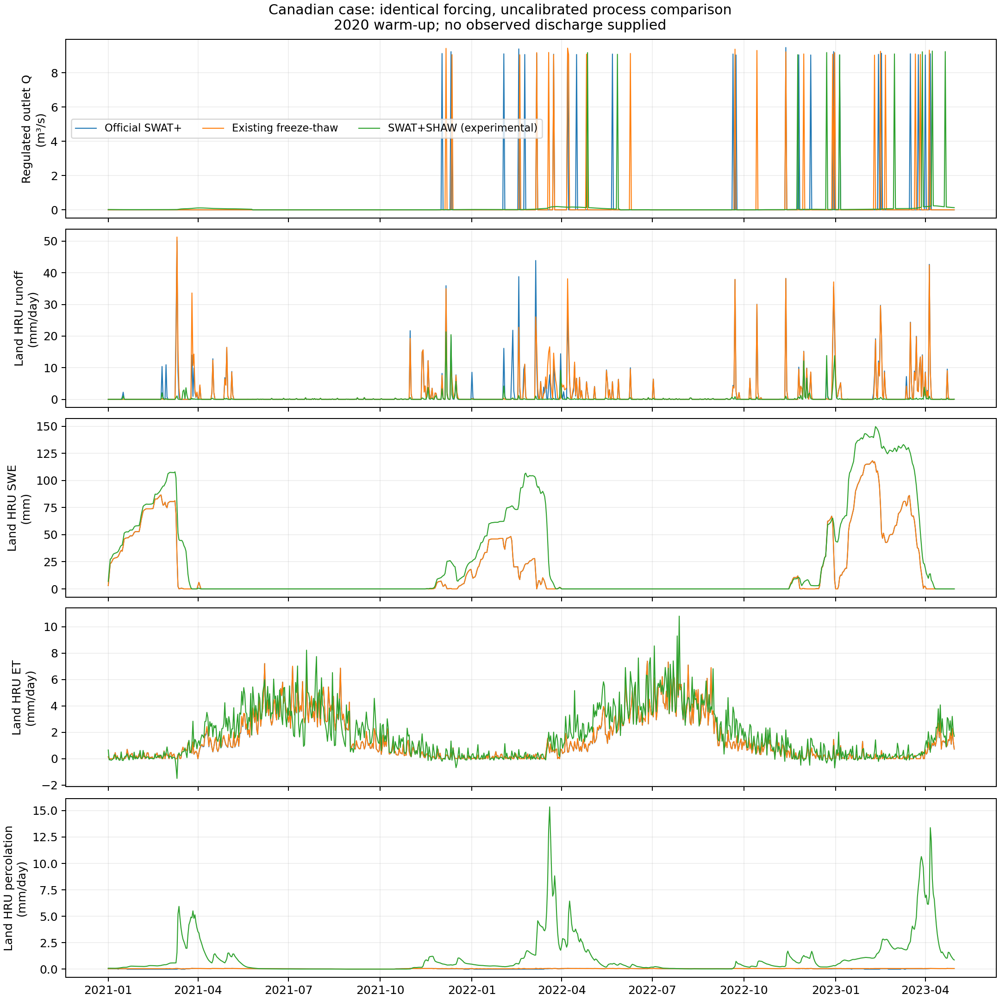
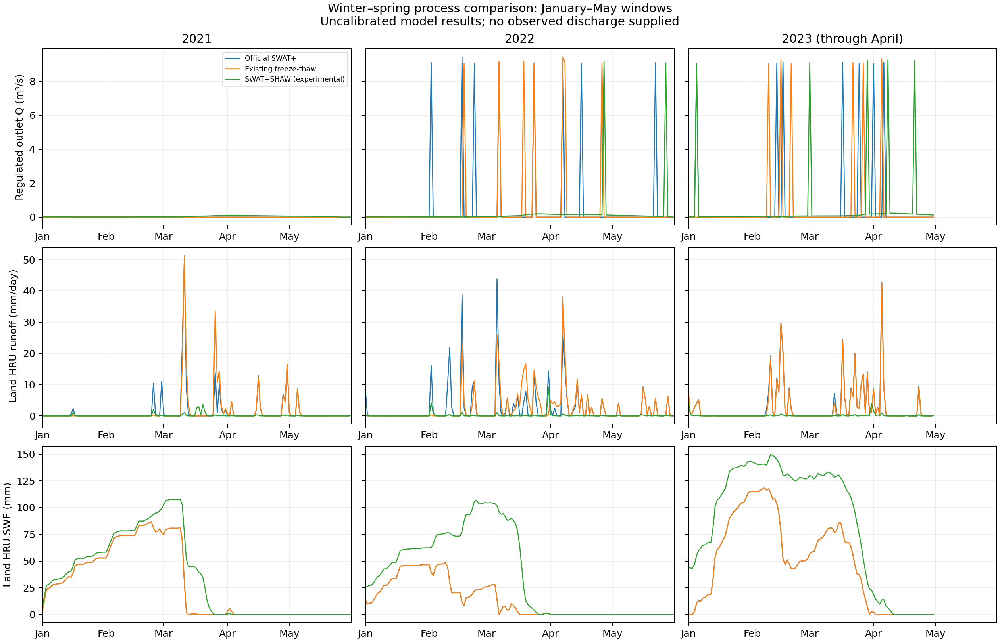
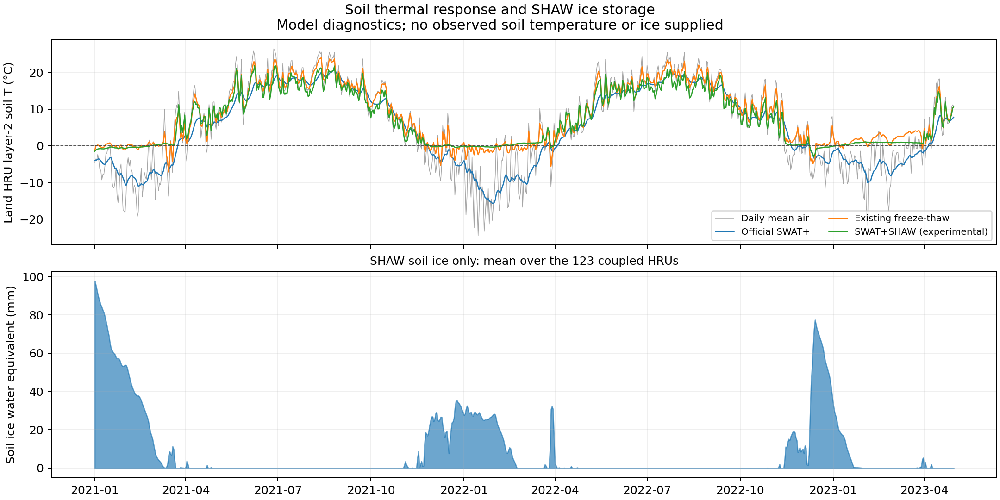

# 加拿大流域 SWAT+、既有冻融版与 SHAW 耦合版过程对照

三个版本均已完成 2020-01-01 至 2023-04-30 的 1,216 天模拟。**本次结果是未率定的模型过程差异比较，不能证明预测精度提高**；提供的案例未附实测流量、雪水当量或土温序列。以下数值由完整运行产物自动生成。

## 数据与可比范围

出口登记汇水面积 **16.353104 km²**（1,635.31040 ha）。其中陆地 HRU 面积 **15.1818012 km²**，独立水库多边形面积 117.13118 ha；两者之和与出口登记面积相差约 9 m²，属于输入取整差异。共有 **142 个有效 HRU**，其中 **123 个**使用 SHAW，面积 1,483.81125 ha，占陆地 HRU 面积的 97.74%。其余 19 个 HRU 保留原始过程；零面积占位对象不计入统计。流量统计使用终端河道 76。

| 过程配置 | HRU 数 | 面积（ha） | 陆地 HRU 面积占比 |
| --- | --- | --- | --- |
| SHAW 耦合 | 123 | 1,483.81125 | 97.74% |
| 城市 HRU，保留原始过程 | 19 | 34.36887 | 2.26% |

逐 HRU 面积、过程配置和选择原因见 [耦合范围 CSV](hru_scope.csv)。若一个 HRU 同时符合多项保留原始过程的条件，表中记录程序最后匹配的原因，每个 HRU 只计一次。

本次重新核对了此前报告的基础口径：旧报告把 HRU 面积的 ha 数值标为 km²，并将该起止日期的模拟天数写为 1,456；本报告区分陆地 HRU 面积与含独立水库的出口汇水面积，按日历计算为 1,216 天。旧报告文件保留原样。原生 `basin_wb` / `basin_pw` 在 `basin_output.f90` 中按陆地 HRU 的 `bsn_frac` 加权，其权重之和为 0.99999888045；这些深度和温度不包含独立水库表面的平均贡献。

2020 年的 366 天作为预热，评价期为 **2021-01-01 至 2023-04-30，共 850 天**。2023 年仅含 1–4 月的 120 天，年度累计量不能与完整年度直接比较。该案例代表加拿大季节性冻土环境，不应据此外推多年冻土区。

案例来自用户此前使用的 [SWAT+ 用户组加拿大数据](https://groups.google.com/g/swatplus/c/lnI2RShJmZw)。三个版本采用相同的 79 个输入文件，沿用此前土壤水文组数字 `3 → C` 的修正，并统一日输出设置；输入 SHA256 清单保存在本机 `validation/canada/input_manifest.json`。原始 AWC 数值问题由共同的 SWAT+ 初始化规则处理，仍是参数解释的限制。

逐日降水和气温来自案例输入，短波辐射、相对湿度和风速来自 SWAT+ 气象发生器。耦合时将日降水均匀分配到 24 小时，重建日内温度与短波，湿度和风速日内保持不变，云量暂定 0.5；这些逐小时序列是构造强迫，不能视为逐小时观测。

除了输入哈希，程序还检查了评价期全部 142 个 HRU、850 天的实际日输出：降水、最高/最低/平均气温、短波辐射、湿度和风速在三个版本间按输出精度完全一致，见 [气象一致性记录](forcing_parity.json)。2020 年预热期未打印这些逐日表，该时段由输入文件哈希覆盖。

共同 SWAT+ 基线为 `61c940f40b5da768edc62a30641d9a1fbebc2708`。既有冻融可执行文件还包含冻融之外的代码修改，因此它与原始版的差异不能全部归因于冻融机制。耦合版只移植与产汇流水热有关的 SHAW 过程，不启用 SHAW 溶质或 CO₂ 过程；仍保留 SWAT+ 管理、植被生长和空间汇流框架。部分 HRU 保留原始水热过程，出口结果反映这一混合配置。

## 评价期出口流量

| 模型 | 评价期平均 Q（m³/s） | 出口累计径流深（mm） | 平均 Q 相对原始版变化 | 日 Q 与原始版的 RMSE（m³/s） |
| --- | --- | --- | --- | --- |
| 原始 SWAT+ | 0.247169 | 1,110.011 | 基准 | 基准 |
| 既有冻融版 | 0.237558 | 1,066.848 | -3.89% | 1.907573 |
| SHAW 耦合版 | 0.131160 | 589.026 | -46.94% | 1.710962 |

出口累计径流深由日平均流量积分并除以 **16.353104 km² 的出口登记汇水面积**得到；它包含汇流及水库调度后的贡献，不等于 HRU 地表产流。表中的 RMSE 衡量两个模拟序列的差异，不是相对实测的误差，也不是模型优劣排名。

| 模型 | 评价期最大日平均 Q（m³/s） | 发生日期 |
| --- | --- | --- |
| 原始 SWAT+ | 9.484000 | 2022-11-12 |
| 既有冻融版 | 9.449000 | 2022-04-07 |
| SHAW 耦合版 | 9.277000 | 2023-04-08 |

出口 76 直接接收水库 1、地下水对象 5 和汇流单元 97 的来水。水库使用原案例的 `drawdown_days` 规则：高于正常蓄水阈值时按 15 天放水，高于应急阈值时按 5 天放水。当前输入的 `const2=0`，而固定版本的 `res_hydro.f90` 采用 `b_lo=参考库容×const2`，触发正常阈值规则后的放水量因而是当前总库容的 1/15，并非仅释放超出阈值的部分。正常阈值库容为 11,713,117.7 m³，对应约 **9.038 m³/s** 的放水尺度；蓄水、触发、回落的循环与图中约 9 m³/s 的脉冲相符。

| 模型 | Q > 1 m³/s 的天数 | 这些天占累计出口水量 |
| --- | --- | --- |
| 原始 SWAT+ | 23 | 99.995% |
| 既有冻融版 | 22 | 99.995% |
| SHAW 耦合版 | 9 | 73.964% |

以上为输入规则和模拟出口的诊断；本次未启用水库逐日输出，不能视为逐日放水实测归因。三个版本保持相同水库输入，出口峰值时序及 RMSE 对阈值触发日期敏感，不能直接解释为自然融雪洪峰或冻融算法优劣。配置、面积与高流量日统计见 [汇流核查](routing_checks.json)。

SHAW 耦合版相对原始版的陆地 HRU 平均水量分配变化：

- 评价期累计净蒸散：原始版 1,180.496 mm，SHAW 耦合版 1,531.518 mm（变化 +29.74%）。
- 评价期累计地表产流：原始版 1,376.301 mm，SHAW 耦合版 213.393 mm（变化 -84.50%）。
- 评价期累计底部渗漏：原始版 33.311 mm，SHAW 耦合版 887.550 mm（变化 +2564.44%）。

这些差异同时包含冠层、积雪、土壤水热及产流算法的替换效应。尤其是把日雨均匀分为小时输入、由 CN 法转为 SHAW 入渗和地表积水过程，会影响径流与渗漏的分配；本次试验不能把变化全部归为冻融效应。

## 年度过程量

| 模型 | 年份 | 天数 | 平均 Q（m³/s） | ET（mm） | 地表产流（mm） | 渗漏（mm） | 侧向流（mm） | 最大 SWE（mm） |
| --- | --- | --- | --- | --- | --- | --- | --- | --- |
| 原始 SWAT+ | 2021 | 365 | 0.050355 | 542.814 | 372.557 | 12.786 | 11.416 | 86.665 |
| 既有冻融版 | 2021 | 365 | 0.050695 | 547.756 | 382.971 | 16.479 | 15.628 | 86.665 |
| SHAW 耦合版 | 2021 | 365 | 0.017961 | 653.057 | 92.285 | 199.270 | 0.000 | 107.975 |
| 原始 SWAT+ | 2022 | 365 | 0.350936 | 589.421 | 675.102 | 16.332 | 18.569 | 67.153 |
| 既有冻融版 | 2022 | 365 | 0.352217 | 592.040 | 658.664 | 20.850 | 24.870 | 67.153 |
| SHAW 耦合版 | 2022 | 365 | 0.134222 | 792.108 | 103.692 | 362.170 | 0.000 | 106.795 |
| 原始 SWAT+ | 2023（1–4 月） | 120 | 0.530190 | 48.261 | 328.642 | 4.193 | 2.787 | 118.262 |
| 既有冻融版 | 2023（1–4 月） | 120 | 0.457181 | 49.252 | 317.476 | 7.883 | 12.687 | 118.262 |
| SHAW 耦合版 | 2023（1–4 月） | 120 | 0.466164 | 86.353 | 17.416 | 326.110 | 0.002 | 149.739 |

ET、地表产流、底部渗漏和侧向流为陆地 HRU 面积加权的时段累计深度；SWE 为该时段最大陆地 HRU 平均积雪水当量。这里的面积口径与出口径流深不同。最大日平均 Q 不等于瞬时洪峰。完整降水、降雪和融雪等统计见 [年度 CSV](annual_comparison.csv)，逐日序列见 [逐日 CSV](daily_comparison.csv)。

[科学绘图 PDF](process_comparison.pdf)

## 冬春过程与季节统计

下图放大各年 1—5 月的出口流量、地表产流和积雪过程；2023 年仅到 4 月底，5 月留空。各列采用相同纵轴，便于比较幅度。季节累计与峰值见 [季节 CSV](seasonal_comparison.csv)：采用气象季节 DJF/MAM/JJA/SON，12 月归入下一冬季年份；2021 冬季缺少预热期的 2020 年 12 月，2023 春季缺少 5 月，均标为不完整季节。

[冬春绘图 PDF](winter_spring_comparison.pdf)

## 土温与土壤冰

| 模型 | 第二土层平均 T（°C） | 最低 T（°C） | 最高 T（°C） | 面平均 T < 0°C 的天数 |
| --- | --- | --- | --- | --- |
| 原始 SWAT+ | 4.758 | -15.707 | 20.820 | 340 |
| 既有冻融版 | 8.131 | -7.150 | 24.028 | 139 |
| SHAW 耦合版 | 7.265 | -2.958 | 21.870 | 147 |

土温来自三个版本共同输出的 `basin_pw_day.txt: sol_tmp`，源代码均取 `soil(j)%phys(2)%tmp` 后按陆地 HRU 面积汇总，即 **SWAT+ 第二土层温度**，不是地表温度，也不代表全流域统一物理深度。温度低于零的天数按日输出精度判定，指面平均序列过零，不能解释为所有 HRU 的冻结持续天数或冻土面积比例。

[土温与冰储量绘图 PDF](thermal_comparison.pdf)

下半图仅显示 SHAW 耦合域的土壤冰水当量，不含积雪；评价期最大耦合域平均土壤冰储量为 97.708 mm。当前原始版及既有冻融版运行没有同口径土壤冰输出，因此不构造其冰量曲线。逐日温度及冰量与水文量一同写入逐日 CSV。

## 耦合域水量收支与数值重试

逐 HRU 日账本采用 `储量变化 − 降水 − 外部土壤来水 − 地表来水 − 冠层空气水量交换 + 净蒸散 + 径流 + 底部渗漏 + 侧向流`。冠层空气水量交换是冠层几何变化导致的空气控制体水汽储量变化，独立记为有符号输入，不并入物理蒸发；冰和雪均换算为液水当量。

| 时段 | 天数 | 最大单 HRU 日残差绝对值（mm） | 累计有符号残差（mm） | 累计绝对残差（mm，先逐 HRU 取绝对值） | 累计冠层空气水量交换（mm） |
| --- | --- | --- | --- | --- | --- |
| 完整模拟 | 1216 | 0.007808 | 0.310735 | 0.442391 | 0.040389 |
| 2020 预热 | 366 | 0.007808 | 0.113810 | 0.168966 | 0.023445 |
| 评价期 | 850 | 0.006541 | 0.196925 | 0.273425 | 0.016944 |

累计残差及冠层交换以 **SHAW 耦合域面积**加权；它们不是全流域水量平衡，也不能用来证明能量守恒。累计绝对残差先对每个 HRU 每天的残差取绝对值，再按面积加权和累计，避免不同地点或日期的正负误差互相抵消；最大单 HRU 日残差同时检查局地误差。汇总 JSON 另保留“先面平均、再逐日取绝对值”的统计，两个指标不能混用。程序保留 `0.1 mm/HRU/day` 的停止门槛，累计误差须结合模拟长度阅读。

| 时段 | HRU·日 | 发生重试的 HRU·小时 | 小时占比 | 发生重试的 HRU·日 | 最大小时分段数 | 采用附加导数的 HRU·小时 |
| --- | --- | --- | --- | --- | --- | --- |
| 完整模拟 | 149,568 | 12,642 | 0.3522% | 3,685 | 8 | 560 |
| 2020 预热 | 45,018 | 3,813 | 0.3529% | 844 | 8 | 41 |
| 评价期 | 104,550 | 8,829 | 0.3519% | 2,841 | 8 | 519 |

重试计数包括时间细分或附加交换系数导数的 HRU 小时，不是程序耗时。未收敛尝试先完整恢复状态，在同一步长下尝试包含冠层交换系数温度导数的迭代矩阵；仍不收敛再缩短步长，最多把一小时分成 64 段。两种矩阵求解相同的物理方程，采用相同的收敛门槛。未收敛结果不会自动接受或静默退回原始 SWAT+。

## 已核验的数值性质

官方算法参照路径比较 720 小时、282,960 个物理数值，不一致数为 0，最大绝对差为 0.000000000。该检查使用无溶质、相同适配器输入和匹配编译精度；不包括官方输入读取器的全面验证。

独立/交替土柱检查为 240 小时，最大逐小时水量残差 0.000981832 mm，验收限值为 0.002 mm。

动态冠层检查为 288 小时，最大逐小时水量残差 0.001318481 mm，验收限值为 0.002 mm。

冠层交换系数温度导数与原始函数有限差分比较，最大缩放差 1.31934e-07，限值 1e-05。

根系供水检查覆盖干湿土层反例、节点排序、零需求及微小通量；每个接受小时另检查根系吸水与蒸腾差不超过 1e-6 mm。

加拿大关闭耦合回归：95 个文件、484,287 个数据行在构建标题行之后与固定官方版本完全一致。本报告要求关闭耦合和启用耦合使用同一可执行文件 SHA256。

另行由固定官方可执行文件生成的 Ames 结果，在 42 个指定输出文件中与关闭耦合版一致。仓库历史 golden 输出本身与该官方版本存在差异；原有 Ames golden CTest 仍报告失败，不能称整个 CTest 全部通过。

完整流域与单独 HRU 运行的交叉检查：HRU 1, 6, 19, 98 共 4,864 个逐日记录、每行 20 列完全一致。比较包括状态、通量和重试计数；该案例的这些 HRU 没有上游 HRU 来水，因而应当一致。

原生最小步长处保留六处大幅更新保护，越界尝试完整回退。历史捕获的 HRU 19 失败小时重放时用 2 个分段通过，水量残差 -0.000116399 mm；该重放的水热内核源码与本次相同，详见最小步长保护复查记录。

耦合桥接启用了冠层储量项迭代系数、叶片消元及根系非负供水修正，而官方参照试验采用保留原始算法的路径；两者不能混称为与官方算法逐位一致。根系修正通过重算有效供水土层避免吸水超过蒸腾，不以调整水量账本消除残差。降雪统计依据原始湿球温度规则记录截留前的大气降雪。状态隔离、冠层控制体交换及修正依据见 [数值审查记录](../NUMERICAL_AUDIT.md)。实现及试验入口：[SWAT 桥接](../../src/shaw_swat_module.f90)、[土柱接口](../../src/shaw/shaw_column_api.f90)、[列间状态试验](../../tests/test_shaw_columns.f90)、[动态冠层试验](../../tests/test_shaw_canopy.f90)、[根系试验](../../tests/test_shaw_roots.f90)、[交换系数导数试验](../../tests/test_shaw_conductance.f90)、[官方参照试验](../../tests/test_shaw_reference.f90)、[内核检查记录](kernel_checks.json)、[Ames 比较记录](ames_pristine.json)。

## 解释限制与后续验证

当前气孔和植被水力参数采用默认值；残茬层尚未由 SWAT+ 映射，管理引起的土壤物理参数变化尚未逐日同步。底部固定温度取气象发生器的年均气温，外部来水按接收土层温度进入，侧向系数缺乏独立各向异性资料。这些设置会影响水热分配，原 SWAT+ 参数也不能直接等价为 SHAW 参数。耦合 HRU 的 `esoil` 表示净蒸散扣除蒸腾后的剩余量，可能包含截留蒸发、雪升华或凝结，不能独立解释为裸土蒸发。

现有 SWAT+ 养分程序只处理向下渗漏。桥接保留 SHAW 内部有符号的水通量和水热状态，仅把土层底部日净水通量的正值传入这些旧程序，避免负渗漏造成养分凭空增加；未实现向上溶质输运，也未从这一总水通量中单独剔除水汽贡献。这是水热研究原型的兼容边界，不是完整溶质耦合。评价期耦合 HRU 的 104,550 条植被/气象记录中，25 个数值字段均为有限值，底部硝态氮输出均非负，见 [接口检查](transport_compatibility.json)。这项检查不能代替水质验证。

进一步判断科学增益，需要真实逐小时强迫、观测流量及积雪/土温资料，开展分模型率定和独立时段验证，并补充网格与时间步收敛、完整能量账本、深层边界敏感性和更多下垫面试验。水质代码保留并不意味着它对新水通量的适用性已通过验证。详细接口假设见 [耦合说明](../../SWAT_SHAW.md)。

## 复现标识

| 运行 | 耗时（秒） | 完成时间（UTC） | 可执行文件 SHA256 |
| --- | --- | --- | --- |
| 原始 SWAT+ | 3.797 | 2026-09-06T03:13:45.664023+00:00 | `f290f5334dc0889d951859754a0a7f4df9c15193016424207ee48890ff4bdb1a` |
| 既有冻融版 | 28.422 | 2026-09-06T03:14:10.703628+00:00 | `9d0c219b38af71e2e8c209a000cdd6c405f12861d8d7541a936d45e13b1c2afa` |
| SHAW 耦合版 | 4,926.984 | 2026-09-07T17:08:52.679558+00:00 | `64a9a05974e0bfe950779d70217b996a1fd41101b8f62131a8e71a9532a8fb56` |
| 关闭耦合回归 | 3.922 | 2026-09-07T15:40:38.356948+00:00 | `64a9a05974e0bfe950779d70217b996a1fd41101b8f62131a8e71a9532a8fb56` |

耗时是本机此次运行记录，未控制重复次数与系统负载，不能作为稳定性能基准。原始输入和完整运行输出保留在本机，未随代码上传。

报告数据源 SHA256（下列文本统一将 CRLF 换行为 LF 后计算，便于核对 GitHub 存档；各运行记录内部的输入、输出及可执行文件哈希仍对应本机原始字节）：

- `summary.json`：`0235feddc5b17fd299b1b4bc089a9635407a3f924ce7682364f7260d22df36f1`
- `analysis_status.json`：`307f8107a3a799e98fb36bf4e5c7c48d4c55b0d60ce30eaf62bec273369304c4`
- `annual_comparison.csv`：`c50f1b1582fb5143073ff513644b8e6c252623c8f956d95249cb355f2be14a9c`
- `daily_comparison.csv`：`b2f8582938565df1f71615a62c726031d0a0b978afb58d00dba0096b36547ab0`
- `seasonal_comparison.csv`：`1adc48675ac2951d3d9207337055376f527bffaad8b3b5172e428211f0626b8f`
- `hru_scope.csv`：`9de02c10c4485952af53c385a4b97abdee5389b9ff9852ee97eb71fd2f742ac7`
- `forcing_parity.json`：`92468be78b1e229562767741c06f33d33999f1c2789e3db219eb127a4c98bf18`
- `transport_compatibility.json`：`dfac6e4f2c7ecf9a81b2b7f0644722cec06797c18d02e5199d56e092002a56b7`
- `routing_checks.json`：`2bc1a96541d79cb8749d8aaea77d41c6abd6bb8ba694b6a8af5729535134b294`
- `kernel_checks.json`：`f7848c8cf4a7cbe222724e9835e6a90c3f595ad5a4f0ea8cc8ec87e409a66487`
- `ames_pristine.json`：`fade544bc074a493af8f5b50dce0ed8e2fad69e96602a007825714f78c7f50a3`
- `basin_column_parity.json`：`90fee392be3f7a0f1c43c5c06a43e15b619bc0989898da49c90d88ef53542bf3`
- `minimum_step_guard_check.json`：`3845cc6498db8695708c333b1a7692a073d2e12fc88b1fcfc84281bf3152189e`

先完成四项运行及独立 HRU 检查，再依次执行 `tools/check_canada_column_parity.py`、`tools/analyze_canada.py` 和 `tools/write_canada_report.py`。报告生成器要求状态文件与汇总均完成、运行标识一致，并核对 9 条年度统计与 850 天日序列；任何运行重新开始后，必须重新生成分析，不能复用本报告。
