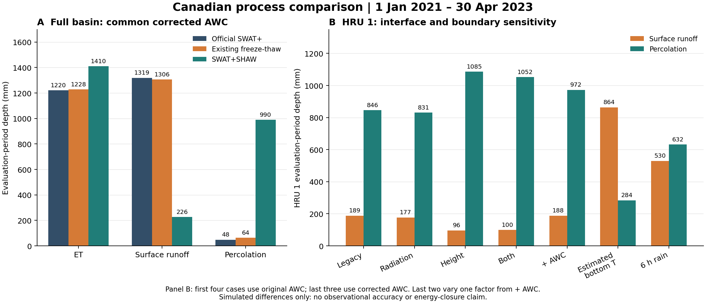

# Post-review Canadian process comparison

All three full-basin simulations completed for 2020-01-01 through 2023-04-30. The first 366 days are warmup; the table covers 850 evaluation days. All three use the same corrected AWC inputs. The SHAW case also uses the reviewed radiation and forcing-height interfaces. The fixed 1.026 m thermal boundary and uniform 24-hour precipitation remain the reference settings.

These are simulated process differences. There are no independent snow, soil-temperature or discharge observations in this case. The existing FT executable includes other changes, so its differences are not attributable solely to freeze-thaw. The historical report is preserved in ../canada/REPORT.md.

## Full-basin totals

| Model | ET (mm) | Surface runoff generated (mm) | Percolation (mm) | Lateral flow (mm) | Mean outlet flow (m3/s) |
|---|---:|---:|---:|---:|---:|---:|
| official | 1220.420 | 1318.633 | 47.722 | 37.092000 | 0.215294 |
| existing_ft | 1228.114 | 1305.569 | 63.584 | 58.637000 | 0.215068 |
| shaw | 1410.186 | 225.846 | 989.980 | 0.006000 | 0.146230 |

All models receive 2615.400 mm precipitation. HRU weather matches exactly for 142 HRUs and 850 evaluation days, including generated variables.
The outlet remains controlled by the unchanged reservoir release rules. An outlet difference is not an accuracy score. The fraction of discharge on days above 1 m3/s is: official: 20 days, 99.974%, existing_ft: 20 days, 99.661%, shaw: 10 days, 73.868%.

## HRU 1 attribution

Only the selected HRU uses SHAW in these experiments. Its values below are HRU totals, not basin totals. All runs cover the same period and use the same parameters except the explicitly listed factors.

| Case | AWC | Radiation | Forcing height | Thermal / rain | ET (mm) | Runoff (mm) | Percolation (mm) | Lateral (mm) |
|---|---|---|---|---|---:|---:|---:|---:|
| legacy_hru1 | original | legacy_north | legacy | fixed / 24 h | 1600.656 | 188.599 | 846.031 | 0.000150 |
| radiation_hru1 | original | aspect_or_horizontal | legacy | fixed / 24 h | 1626.701 | 177.108 | 831.203 | 0.000150 |
| height_hru1 | original | legacy_north | fixed | fixed / 24 h | 1455.699 | 96.281 | 1085.466 | 0.000449 |
| combined_hru1 | original | aspect_or_horizontal | fixed | fixed / 24 h | 1485.738 | 99.513 | 1051.959 | 0.000449 |
| corrected_hru1 | awc | aspect_or_horizontal | fixed | fixed / 24 h | 1467.954 | 188.198 | 972.437 | 0.004973 |
| thermal_hru1 | awc | aspect_or_horizontal | fixed | estimated / 24 h | 1479.056 | 863.632 | 284.098 | 0.023214 |
| rain6h_hru1 | awc | aspect_or_horizontal | fixed | fixed / 6 h | 1463.336 | 529.692 | 631.647 | 0.004515 |

The first four cases isolate radiation and forcing-height changes and their combination on the historical inputs. Comparing combined_hru1 with corrected_hru1 isolates the AWC conversion. The last two alter only the bottom-temperature rule or rainfall duration relative to corrected_hru1. Nonlinear interactions mean the separate effects need not sum to the combined effect.
The estimated thermal case uses native SHAW ITMPBC=1 without adding water storage; it does not test a 4 m deep boundary. The six-hour rain case distributes the daily total over hours 13–18. These synthetic experiments do not identify the real storm timing or correct thermal boundary.
The native estimated bottom-temperature option increases HRU 1 runoff from 188.198 to 863.632 mm while percolation drops from 972.437 to 284.098 mm. Concentrating rain into six hours raises runoff to 529.692 mm. These responses identify high sensitivity to boundary/forcing choices; they do not establish which configuration is physically correct.

## Verification

- Complete SHAW ledger: 149,568 HRU days; maximum absolute daily water residual 0.008281023 mm; maximum accepted hourly subdivision 32.
- Four representative columns (HRUs 1, 6, 19, 98) match their independent runs exactly: 4,864 HRU days and 102,144 values, including the new snow diagnostic.
- Coupling-off regression: 95 native output files / 484,287 data rows equal the corrected official run after the banner.
- Legacy configuration replay: HRU 1, 1,216 days / 24,320 original diagnostic values exactly reproduce the pre-review result.
- Eight SHAW CTests passed. Original-algorithm reference: 720 hours / 282,960 values identical; this checks extraction and state isolation, not basin parameter realism.
- All 25 inspected native plant/weather fields are finite for 123 coupled HRUs over 850 days; bottom nitrate export is nonnegative. This is an interface compatibility check, not validation of solute physics.
- The new snow_liquid_release_mm equals native snomlt on coupled HRUs within printed precision for all 104,550 evaluation HRU days. It may include rain through snow and is not pure phase-change melt.
- Hourly diagnostic cases preserve every daily precipitation total. All reported water residuals were independently reconstructed from storage and flux columns.

## Interpretation and remaining work

The corrections and unit repair leave a pronounced redistribution toward percolation and away from surface/lateral runoff. These changes cannot be attributed solely to freeze-thaw. The remaining process differences include replacing CN runoff, native SHAW saturated lateral-flow physics, free drainage, synthetic storm timing, and default canopy hydraulics.
The shallow fixed-temperature reference boundary remains a major physical assumption. Real aspect data, reliable above-canopy meteorology, deeper-boundary experiments, complete energy accounting, grid/time convergence and independent observations remain necessary for stronger scientific claims.

Inputs and unit evidence: [AWC audit](../canada_awc/REPORT.md). Interface assumptions and controls: [interface review](../INTERFACE_REVIEW.md). Numeric evidence: summary.json, basin_checks.json and basin_daily.csv. All runs are isolated under validation/canada/interface_review.

SHAW executable SHA256: 59f0ed0d4d49fd1f09636a659ebea1de4840fcc861d960447bcc0c27c4b42903. The full run took 10411.125 s on this host; this single uncontrolled run is not a performance benchmark.
